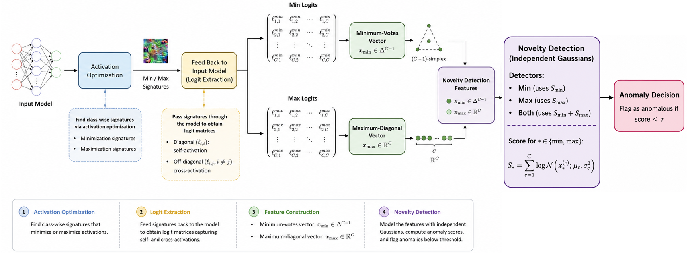

# POIS-DON: POISON DATASET-DRIVEN ACTIVATION OPTIMISATION-BASED NOVELTY DETECTION

**Authors:** Ahmed Gabr, Mahmoud Rady, Pola Qulta, Youssef Abou Eita, Youssef ElKady, Youssef Fayed, Marwan Torki  
**Affiliation:** Alexandria University, Egypt

> 🚧 **Code Release Status:** This paper has been accepted to ICIP 2026. The full codebase, including our activation optimization scripts and feature extraction pipeline, is currently being organized. The complete code will be released here. 

## Abstract

Backdoor attacks, in which a model's behavior is altered by embedding a trigger into the input to cause targeted mis-classifications, pose an increasing security threat to deep neural networks. This is particularly concerning given the widespread reliance on open-source pre-trained models to overcome data and computational constraints. 

We propose a novel, attack-agnostic, and computationally efficient method for detecting poisoned models. Our approach uses activation optimisation to generate per-class optimised logit outputs that serve as model signatures. Instead of training a meta-classifier on the signatures, our method leverages statistical features for anomaly detection. We demonstrate that our method is robust to various trigger types, attack strategies, including [BadNet](https://arxiv.org/abs/1708.06733), [Sinusoidal](https://ieeexplore.ieee.org/document/8802997), and [WaNet](https://arxiv.org/abs/2102.10369), as well as model architectures such as VGG and ResNet, without requiring retraining. We validate our approach on three popular image-classification Trojan model benchmarks: the [ULP](https://github.com/UMBCvision/Universal-Litmus-Patterns) CIFAR-10 and Tiny-ImageNet, and the ImageNet Vision Transformer-based [TAT dataset](https://github.com/vimal-isi-edu/trigs).

## Method Overview

Our proposed pipeline extracts minimization and maximization signatures for each class, which are fed back into the model to generate two logit matrices. From these, we compute the Min Votes and Max Diagonal features, concatenate them, and pass them to Pois-DON. Crucially, rather than training an external meta-classifier on the signatures, we use lightweight statistical features computed directly from the model's logits.

